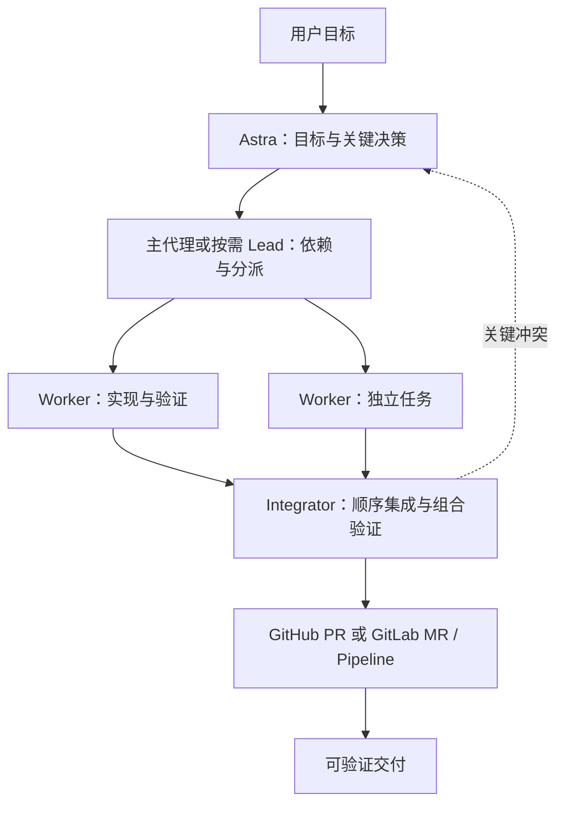

# Astra Execution · Astra 分层执行

一套面向 Codex 的软件任务执行 skill：由 Astra 保留目标与关键决策，按依赖分派执行者，隔离写入，并在集成后的版本上验收。支持 GitHub 和 GitLab，包括自部署 GitLab。

本仓库提供可复用的指令与交接协议。它使用宿主已有的 agent、Git、认证和调度能力，无须安装额外编排平台。

## 工作方式



- 按可独立验收的行为拆任务，每项只有一个写入负责人。
- 按依赖、实际槽位和集成吞吐调整并发，不固定十路执行。
- 通过任务包传递必要上下文，长日志和证据按需读取。
- 独立 worktree 隔离文件；共享端口、数据库、Git 操作另行协调。
- 检查对应实际交付版本，旧提交的绿色结果不能覆盖新版本。
- 执行验收检查，将具体失败交回负责人修复，重验受影响部分；硬门槛通过后再比较成本和时间。
- 遇到重复失败，带证据换策略或升级；不无限重试。
- 简单修改直接执行，大任务才增加协调与集成角色。

## 验证循环

把需求中的可观察行为对应到现有测试或验收方式，再执行“实现 → 检查 → 分类诊断 → 修复 → 重验”。记录实际被测版本与证据；测试缺陷、环境故障和规格缺失分别处理，避免反复修改无关代码。最终集成版本仍需满足项目要求的检查。

具体协议见 [verification.md](references/verification.md)。它提供按需使用的记录示例与升级规则，不附带通用测试运行器，也不会自动创建 CI 或后台服务。优先复用项目已有检查，短任务无需新建流水线或独立账本。

## 安装

将本仓库下载或克隆为 Codex 当前个人 skills 目录中的 `astra-execution` 文件夹。使用 `$CODEX_HOME/skills` 配置的环境可放入该目录；默认个人目录的示例是 `~/.codex/skills/astra-execution`。若宿主使用其他 skill 路径，以实际配置为准。

安装后的结构应包含：

```text
<skills-directory>/astra-execution/
├── SKILL.md
├── agents/openai.yaml
└── references/
```

在 Codex 中选择 `astra-execution`，或在请求中写 `$astra-execution`。列表未更新时重新打开聊天或刷新技能列表。已有同名目录时先核对内容，不覆盖自己的修改。

## 使用

当前仓库：

```text
使用 $astra-execution 完成当前需求，按依赖并行实施，验收后交付可审查补丁。
```

自部署 GitLab：

```text
使用 $astra-execution 处理 https://gitlab.example.internal/team/subgroup/project
的 Issues #12、#15、#18。复用当前认证，完成实现、验证并创建 MR；暂不合并或部署。
```

已授权交付：

```text
使用 $astra-execution 继续当前项目。满足项目审批和 CI 条件后合并到 develop，
按已有流程部署 staging；本轮不发布 production。保留关键决策和验证记录。
```

恢复长任务：

```text
使用 $astra-execution 从现有任务账本恢复，核对 worker、提交及 MR/Pipeline 状态，
继续剩余任务，不重复创建已有 MR。
```

## 自部署 GitLab 支持

适配协议覆盖实例 Web/API 地址、端口与部署子路径、嵌套 namespace、项目 ID 与 Issue/MR iid、分页、MR 查重、Pipeline 和实际合并条件。

复用已有连接器、已认证的 `glab` 或允许的 REST 客户端。普通 Pipeline 与当前源版本关联；merged-results / merge train 检查合成提交与当前源、目标的关系。按实例版本、套餐和项目配置识别审批及自动合并能力。

详见 [Git 平台适配](references/git-forges.md)。不需要向聊天粘贴 token；内网、认证或 CA 问题不会通过关闭 TLS 校验解决。

## 文件导航

| 文件 | 内容 |
| --- | --- |
| [SKILL.md](SKILL.md) | 入口、角色、调度、升级与收尾 |
| [runtime.md](references/runtime.md) | 模型/槽位、worktree、持久状态和后台边界 |
| [contracts.md](references/contracts.md) | 账本、任务包、验收交接和决策模板 |
| [verification.md](references/verification.md) | 验收质量、反馈修复、失败分类和证据记录 |
| [integration.md](references/integration.md) | 审查、顺序集成与交付 |
| [git-forges.md](references/git-forges.md) | GitHub 与自部署 GitLab |
| [sources.md](references/sources.md) | 编排方案、验证循环研究与设计取舍 |

## 依据与验证范围

参考 Agent Orchestrator、Gas Town、Symphony、Claude Squad、Xum、Vibe Kanban、Claude Agent Teams、Superpowers、Spec Kit、OpenHands、LangGraph 和 Beads，并核查 OpenAI/GitLab 官方文档。来源和维护状态记录于 [sources.md](references/sources.md)，核查日期为 2026-09-29。

此前版本已通过结构、UTF-8、相对引用与 UI 元数据检查，并进行两轮独立前向验证，覆盖五个本地模拟场景：共享目录依赖与过期测试、单点修改、GitLab 子路径/分页/创建超时、合并时提交变化、合成 Pipeline。单点场景实际修改并核对了隔离样例；远端操作均为模拟。

本次验证循环更新通过技能校验器、UTF-8、相对引用、JSONL 示例和 UI 元数据检查，并完成独立的三组只读情景检验：简单拼写修改、未提交增量与测试数据库故障、依赖阻塞/并发满额/重复失败与成本归因。情景检验核对决策和交接，未替代真实项目运行或模型效果基准。

尚未对真实自部署 GitLab 做端到端联调，也没有实测模型费用或吞吐收益。模型分工是可用时的建议，具体取决于宿主能力；本 skill 不会切换主会话模型、创建后台服务或自动取得发布权限。
